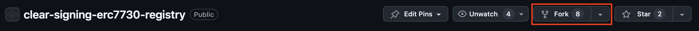
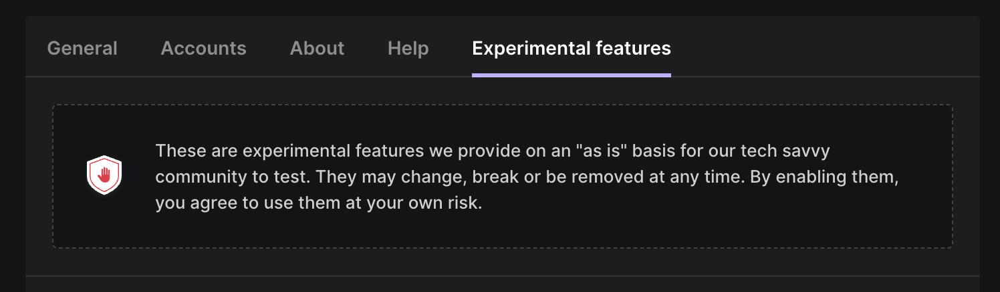
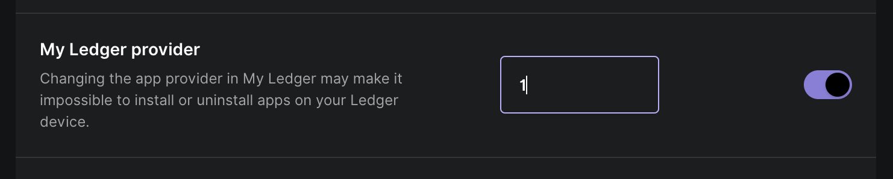

# ERC-7730 workshop


## Pre-requisites

You'll need:
- Git ([How to install](https://git-scm.com/book/en/v2/Getting-Started-Installing-Git))
- NodeJS (minimum version 18.17.0) ([How to install](https://nodejs.org/en/download/package-manager))
- A text editor (VS code, vim, emacs...)
- A github account
- Ledger Live
- A terminal

You will also need a Ledger Stax or Ledger Flex if you want to try your descriptor on a device.

## Cloning the repository

First you'll need to clone this repository

```
git clone https://github.com/LedgerHQ/erc-7730-workshop.git
```

```
cd erc7730-workshop
```

Then we need to clone ERC-7730 registry

```
git submodule update --init --recursive
```

And finally in the context of the workshop, we will be using the demo branch of the registry. This will allow us to upload test descriptors.

```
git submodule foreach -q --recursive \
  'branch="$(git config -f $toplevel/.gitmodules submodule.$name.branch)"; git switch ${branch}'
```


## Build and run developer tools

To build and run the developer tools run:
```
cd clear-signing-erc7730-registry/developer-preview
npm i
npm run dev
```
You can now open the developer tools on [http://localhost:3000](http://localhost:3000)

## Create your own descriptor

Create a directory inside the `registry` folder with the name of your dApp. Inside this folder you can create descriptors for your contract or your typed messages.

You can write your descriptor with your favorite text editor and review the screen by using the [developer tools](http://localhost:3000)

**:warning: The current version of the Ledger ETH embedded application only supports clear signing for EIP712.**

If you don't have a contract or typed message or if you need some example, a sample descriptor is available [here](samples/1inch-EIP712Permit.json). 

You can also read [ERC-7730 specifications](https://github.com/LedgerHQ/clear-signing-erc7730-registry/blob/master/specs/erc-7730.md) to learn about the different types and features.

## Create a PR on the registry repository

First you'll need to fork the registry repository on github to create your Pull Request. Head on [https://github.com/LedgerHQ/clear-signing-erc7730-registry](https://github.com/LedgerHQ/clear-signing-erc7730-registry) and click on the "fork" button to create your fork.



Then you'll add your fork as a remote tracked repositories by running:

```
cd clear-signing-erc7730-registry
git remote add fork *forked repository URL*
```

Add your files and commit.

You can now push your commit to your forked repository.

```
git push fork demo
```

Finally create a Pull Request on github. Make sure to create the PR with your fork demo branch to the demo branch of Ledger's repository.

Your Pull Request will be run by the CI and must be approved by a Ledger employee before being merged and signed by the repository. In the meantime you'll need to prepare your device to use descriptors from the demo environment.

## Setting up your device for the demo environment

In order to test your descriptor you will need a version of the ethereum embedded application. This version of the application will be able to accept signatures from the demo branch.

*If you don't have a Ledger Flex or Ledger Stax device, you can skip this phase*

In Ledger Live (desktop application), open the settings and click on the experimental features flag.



Now you'll to activate the feature called "My Ledger provider".


- If you have a **Ledger Flex**, replace the number with **82**.
- If you have a **Ledger Stax**, replace the number with **83**

**:warning: If Ledger Live is notifying you of a new firmware update while you are on a test provider, DON'T update your device. There may be no way to restore your device after the update.**

Now you can go to **My Ledger** in Ledger Live to install the test Ethereum application.

## Test your descriptor with a Device Management Kit

:warning: Once you PR is approved, it takes approximatively 12 minutes for the CI to deploy your descriptor. 

Open [Device Management Kit](https://app.devicesdk.ledger-test.com/). On your Ledger device open the Ethereum application and select it on the Device Management Kit. 

Go to Keyrings / Ethereum / Sign typed message.

- Toggle the test option to use test signatures
- Change the branch to demo
- Enter your message. You can find a sample message [here](samples/message.json)
- Replace the **calURL** with `https://crypto-assets-service.api.aws.stg.ldg-tech.com/v1`

Finally click on "Execute" and your message will appear on the device display!


## Finally

Make sure to disable the **My Ledger provider** feature in the experimental features tab of Ledger Live settings. 